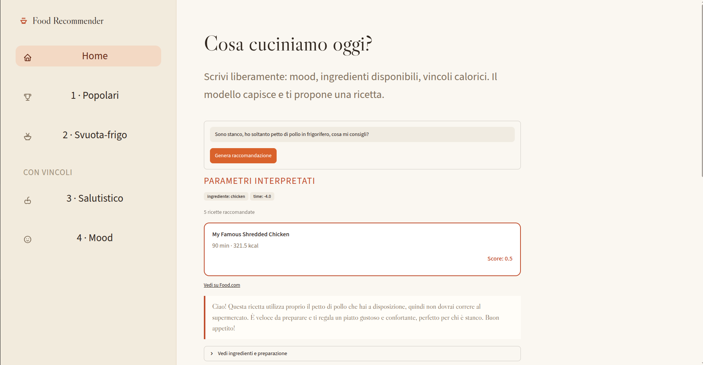

## 🏡 Home (LLM) — Esempi di Utilizzo e Raccomandazioni

In questa sezione vengono mostrati gli esempi d'uso della schermata **Home (LLM)**. Il modello interpreta le query in linguaggio naturale, estrae i parametri di intent e restituisce la ricetta consigliata con la relativa spiegazione e il punteggio ibrido.

---

### 1. Ingrediente Singolo + Stanchezza (Immagine 11)

* **Query:** `"Sono stanco, ho soltanto petto di pollo in frigorifero, cosa mi consigli?"`
* **Intent estratto:** `ingrediente: chicken` | `time: -4.0`
* **Risultato:** **My Famous Shredded Chicken** (90 min, 321.5 kcal)
* **Score:** `0.5`
* **Note:** Risultato con spiegazione che sottolinea l'utilizzo prioritario dell'ingrediente segnalato come disponibile.

---

### 2. Dettaglio Ricetta Espanso (Immagine 10)

* **Vista UI:** Dettaglio espanso di **My Famous Shredded Chicken** (90 min, 321.5 kcal, score `0.5`).
* **Ingredienti:** `chicken breasts`, `chicken broth`
* **Preparazione:** Scheda integrata con i 10 step di preparazione.
* **Note:** Dimostrazione dell'integrazione dei dettagli completi della ricetta consultabili direttamente all'interno della schermata Home.

---

### 3. Tempo e Dieta (Immagine 9)

* **Query:** `"Ho molto tempo per cucinare, sono vegano"`
* **Intent estratto:** `time: +5.0` | `tag: vegan` | `profilo: balanced`
* **Risultato:** **Pinto Beans And Rice In A Crock Pot Or On Stove Top** (185 min, 1898.7 kcal)
* **Score:** `0.2`
* **Note:** Score relativamente basso nonostante il pieno match sui vincoli espliciti (tempo prolungato e dieta vegana), utile per analizzare i limiti del calcolo del punteggio ibrido.

---

### 4. Vincoli Calorici e Tempo (Immagine 8)

* **Query:** `"Voglio provare qualcosa di nuovo, sotto le 600 calorie e con una preparazione di al massimo 30 minuti"`
* **Intent estratto:** `modification: +3.0` | `time: -4.0` | `max_calories: 600` | `profilo: balanced`
* **Risultato:** **Sassy S Beef And Broccoli** (20 min, 445.4 kcal)
* **Score:** `0.4574`
* **Note:** Rispetta contemporaneamente sia il vincolo calorico (< 600 kcal) che il limite di tempo (< 30 min).

---

### 5. Query Economica / Leggera (Immagine 7)

* **Query:** `"Ho pochi soldi, voglio qualcosa di fresco ma non troppo calorico"`
* **Intent estratto:** `body: -5.0` | `price: -5.0`
* **Risultato:** **Funfetti Cookies** (35 min, 83.5 kcal)
* **Score:** `0.6`
* **Note:** Mostra un caso limite in cui l'interpretazione congiunta dei termini *"fresco"* ed *"economico"* porta alla scelta di un dolce leggero a basso costo per porzione.

---

### 6. Query Mood Senza Vincoli Stringenti (Immagine 6)

* **Query:** `"Voglio qualcosa di leggero, ho molti soldi a disposizione ma sono stanco"`
* **Intent estratto:** `body: -3.0` | `price: +5.0` | `time: -4.0`
* **Risultato:** **Quesadillas For One Or Two** (15 min, 394.3 kcal)
* **Score:** `0.6`
* **Note:** Generazione di una spiegazione LLM coerente con l'insieme dei parametri estratti dalla query.
